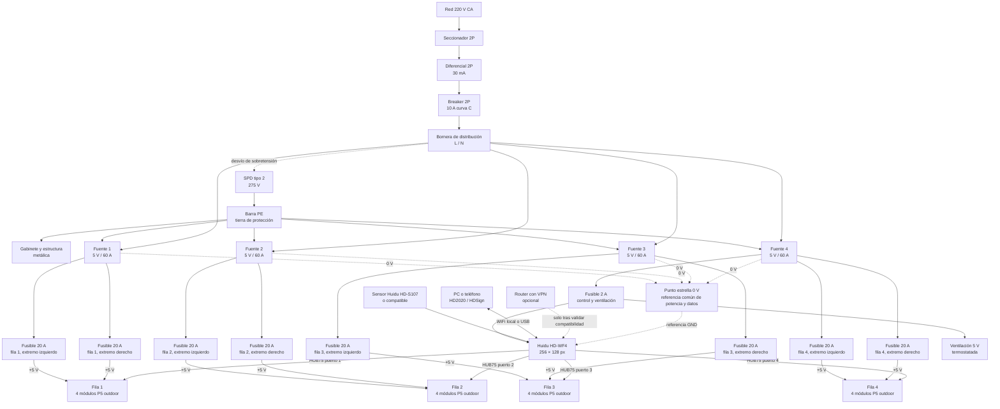

# 07 — Diagrama de bloques funcional

Este diagrama define la arquitectura de referencia para el cartel de 256×128 px con controladora Huidu HD-WF4 y 16 módulos P5 de 320×160 mm. Las fuentes de 5 V no comparten sus salidas positivas.

## Conexiones obligatorias

| Enlace | Implementación |
|---|---|
| Red CA | Línea fija desde tablero, instalada y verificada por electricista matriculado. |
| Protección | El SPD se conecta en paralelo entre L/N y PE, con conductores a tierra lo más cortos posible. |
| Tierra de protección | PE une gabinete, estructura y bornes de tierra de cada fuente. No se usa como retorno de 5 V. |
| Fuentes 1 a 3 | Cada fuente alimenta una sola fila mediante dos ramas 12 AWG, cada una con fusible de 20 A, inyectadas en extremos opuestos. |
| Fuente 4 | Alimenta la fila 4 con dos ramas de 20 A y, mediante un fusible de 2 A independiente, la HD-WF4 y ventilación 5 V. |
| 0 V | Las salidas negativas de las cuatro fuentes se unen en un único punto estrella; la HD-WF4 y los GND de HUB75 toman ahí su referencia. |
| +5 V | No unir positivas de fuentes diferentes. Cada fila recibe potencia exclusivamente de su rama protegida. |
| Datos | Cada salida HUB75 de la HD-WF4 alimenta una única fila de cuatro módulos, encadenados según la dirección `OUT` de cada módulo. |
| Sensor | Usar un sensor compatible con el puerto de la HD-WF4; confirmar modelo y conector con el proveedor de la controladora. |

## Secuencia de puesta en marcha

1. Con el gabinete sin tensión, verificar continuidad de PE y ausencia de continuidad entre PE y los positivos de 5 V.
2. Energizar cada fuente sin carga y ajustar su salida a 5,1 V.
3. Verificar las ocho ramas de inyección de 20 A y la rama de 2 A de control/ventilación.
4. Conectar la HD-WF4, el sensor y una sola fila; importar el archivo de configuración entregado por el proveedor del módulo.
5. Repetir con las otras tres filas y comprobar el mapeo de cada puerto HUB75.
6. Medir 5 V en el módulo más lejano de cada fila a blanco completo; debe mantenerse en 4,85 V o más.
7. Ejecutar prueba de estrés de 24 h antes de cerrar y montar el gabinete en fachada.

## Límites de esta arquitectura

- No hay una fuente de reserva instalada. Para reducir la indisponibilidad, mantener una LRS-350-5 de repuesto fuera del gabinete.
- La HD-WF4 se utiliza para texto, imágenes, reloj y animaciones compatibles con HD2020/HDSign. Validar una animación real en banco antes de producir contenido comercial.
- El anuncio declara HUB75 y scan 1/8. El archivo de configuración, pinout, IC de manejo y compatibilidad con la salida HUB75E de la HD-WF4 deben confirmarse con el vendedor antes de comprar el lote completo.
- Este diagrama corresponde a la ruta de producción con HD-WF4. El driver propio usa **Colorlight 5A-75B** con 8 cadenas de 2 módulos en lugar de 4 cadenas de 4. **El bloque de potencia de este diagrama no cambia** —diferencial, breaker, SPD, las cuatro fuentes y las ocho ramas fusibleadas son idénticos—; solo se reparten distinto los cables de datos y la alimentación de la controladora. Ver [`10_plataforma_driver.md`](10_plataforma_driver.md) y [`11_arquitectura_colorlight_5a75b.md`](11_arquitectura_colorlight_5a75b.md). La vista integrada de esa ruta, de la fuente al display, está en [`16_cadena_completa.md`](16_cadena_completa.md).
