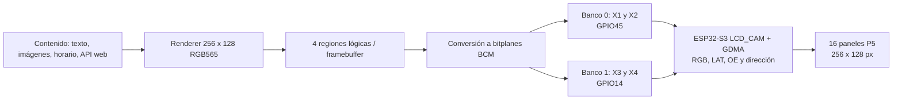

# 09 - Firmware propio para Huidu HD-WF4

> **Documento superado.** La plataforma del driver propio es la **Colorlight 5A-75B**; ver [`10_plataforma_driver.md`](10_plataforma_driver.md) y [`11_arquitectura_colorlight_5a75b.md`](11_arquitectura_colorlight_5a75b.md).
> Se conserva como registro del análisis de la HD-WF4 y de por qué se descartó para esta ruta. La HD-WF4 sigue siendo válida como controladora de producción con su firmware de fábrica y HD2020 / HDSign.

## Decisión y alcance

La HD-WF4 se usará inicialmente con su firmware Huidu y HD2020 / HDSign. Se mantiene una ruta experimental para sustituirlo por firmware propio en ESP-IDF, reutilizando proyectos open source como base del transporte HUB75.

El objetivo del firmware propio es cartelería autónoma a 256 x 128 px: textos, imágenes, playlist, reloj, NTP, horario, brillo y OTA. No convierte la placa en receptor HDMI ni pretende decodificar vídeo H.264. El streaming RGB565 por WiFi puede evaluarse después de estabilizar el refresco del panel.

> No sobrescribir ni borrar la controladora de producción. Antes de reflashear, identificar la revisión y guardar un respaldo completo de flash. Mantener una controladora de desarrollo separada si el presupuesto lo permite.

## Restricción de hardware HD-WF4

La placa conocida como HD-WF4 con ESP32-S3 no presenta cuatro buses RGB independientes. Tiene dos buses RGB y dos bancos habilitados alternativamente. Las líneas de dirección y temporización se comparten.

| Conector | Bus RGB | Habilitación de banco | Fila física del cartel |
|---|---|---|---|
| `X1` | A | GPIO45 alto | Fila 1, 4 módulos en cadena |
| `X2` | B | GPIO45 alto | Fila 2, 4 módulos en cadena |
| `X3` | A | GPIO14 alto | Fila 3, 4 módulos en cadena |
| `X4` | B | GPIO14 alto | Fila 4, 4 módulos en cadena |

Las señales `A` a `E`, `CLK`, `LAT` y `OE` se comparten. El firmware debe mantener un solo banco habilitado durante cada transferencia:

1. GPIO45 alto y GPIO14 bajo: transmitir las filas 1 y 2 mediante `X1` y `X2`.
2. GPIO45 bajo y GPIO14 alto: transmitir las filas 3 y 4 mediante `X3` y `X4`.
3. Repetir el ciclo sin habilitar GPIO45 y GPIO14 simultáneamente.

El módulo candidato declara scan 1/8; en esa configuración normalmente se usan `A`, `B` y `C` para seleccionar filas. Los niveles y el uso efectivo de `D` y `E` se deben confirmar con el perfil de configuración del vendedor y un analizador lógico.

## Arquitectura de firmware propuesta



### Capas

| Capa | Responsabilidad |
|---|---|
| Driver WF4 | LCD_CAM/GDMA, señales HUB75, secuencia de bitplanes y cambio seguro de bancos. Debe residir en memoria interna DMA. |
| Renderer | Canvas RGB565 de 256 x 128, fuentes, imágenes y composición de cuatro filas. |
| Aplicación | Portal web, carga de contenido, playlist, NTP/RTC, horarios, sensor de brillo y OTA. |

El framebuffer RGB565 completo ocupa 64 KiB. Con dos buffers de bitplanes de 4 o 5 bits por color se requieren aproximadamente 32 o 40 KiB adicionales, más descriptores DMA. El diseño inicial no debe depender de PSRAM: la revisión exacta de la HD-WF4 puede no tenerla.

## Rendimiento objetivo

> **Corregido.** La versión anterior de esta sección usaba el ancho físico de la fila (256 px) como cantidad de clocks y subestimaba el trabajo por un factor de 2. El modelo correcto está en [`10_plataforma_driver.md`](10_plataforma_driver.md).

Con scan 1/8 en un módulo de 64 x 32 px, la cadena de desplazamiento interna mide el doble del ancho físico:

```text
2048 px/modulo / 8 (scan) / 2 (grupos) = 128 clocks por paso de direccion
```

Verificación independiente para la pantalla completa, con dos buses y bancos multiplexados:

```text
clocks_por_bitplane = 32768 px / (2 grupos x 2 buses) = 8192
refresco            = f_clk / (8192 x (2^n - 1))
```

| Clock de píxel | 4 bits/color | 5 bits/color |
|---|---:|---:|
| 16 MHz | 130 Hz | 63 Hz |
| 20 MHz | 163 Hz | 79 Hz |
| 24 MHz | 196 Hz | 95 Hz |

Los bancos son seriales y las señales de dirección, `LAT` y `OE` están compartidas, así que 8192 clocks por bitplane es un piso que ningún software baja. **Sobre esta placa, 5 bits por color y 192 Hz son objetivos mutuamente inalcanzables.** Esa limitación es la que motivó el cambio de plataforma.

## Bases open source

| Proyecto | Uso previsto | Estado para HD-WF4 |
|---|---|---|
| [ESP32-HUB75-MatrixPanel-DMA](https://github.com/mrcodetastic/ESP32-HUB75-MatrixPanel-DMA) | Base para LCD_CAM, GDMA, bitplanes BCM y rendering HUB75 en ESP32-S3. | Reutilizable, pero su configuración estándar no entiende los dos bancos WF4. |
| [HD-WF1-WF2-LED-MatrixPanel-DMA](https://github.com/mrcodetastic/HD-WF1-WF2-LED-MatrixPanel-DMA) | Ejemplo Huidu funcional con WiFi, RTC y MatrixPanel DMA. | Referencia de bring-up; está dirigido a WF1/WF2 y un puerto activo. |
| [Arduino-ESP32: variante huidu_hd_wf4](https://github.com/espressif/arduino-esp32/tree/master/variants/huidu_hd_wf4) | Pinout de GPIO, USB, RTC y conectores de la WF4. | Referencia de pinout, no driver de cuatro salidas. |
| [hd-wf4](https://github.com/andywwright/hd-wf4) | Documentación de revisión, flash DIO y habilitación de salidas. | Referencia de hardware; confirmar contra la placa recibida. |
| [matrix-portal](https://github.com/nurikk/matrix-portal/blob/main/wf4_driver_design.md) | Diseño LCD_CAM + RMT para los dos bancos WF4. | Diseño útil, no una implementación lista para producción. |

No se encontró un driver open source funcional y mantenido que controle los cuatro puertos de la HD-WF4 con framebuffer independiente. La tarea clave es implementar el backend WF4 sobre esas bases, no crear otro renderer desde cero.

## Plan de validación

### Paso 0 - Identificar y respaldar

1. Fotografiar ambos lados de la placa, anotar revisión, chip ESP32 y chip de flash.
2. Entrar en modo descarga según la revisión real y confirmar el chip mediante `esptool.py --chip esp32s3 flash_id`.
3. Guardar eFuses y log de arranque. Si hubiera cifrado, el respaldo sigue siendo útil como imagen de recuperación, aunque no sea legible.
4. Guardar los 8 MB completos antes de cualquier escritura:

```bash
esptool.py --chip esp32s3 --port <PUERTO> read_flash 0x0 0x800000 backups/hd-wf4-original.bin
```

5. Leer el log de fábrica para confirmar modo y frecuencia de flash. Usar DIO y una frecuencia conservadora si la revisión usa cFeon QH64A o equivalente; no asumir QIO por defecto.

### Paso 1 - Un panel y un banco

1. Portar un ejemplo mínimo de MatrixPanel DMA al pinout `X1`.
2. Mostrar rojo, verde, azul, blanco, negro, grilla y patrón de direcciones.
3. Repetir en `X3` con GPIO14, dejando GPIO45 bajo.
4. Medir `CLK`, `LAT`, `OE` y dirección con analizador lógico antes de aumentar el clock.

### Paso 2 - Dos buses y dos bancos

1. Validar `X1` y `X2` con imágenes diferentes en las dos filas superiores.
2. Validar `X3` y `X4` con imágenes diferentes en las dos filas inferiores.
3. Alternar ambos bancos en el fin de transferencia DMA y comprobar que no haya ghosting entre filas.
4. Confirmar que GPIO45 y GPIO14 nunca estén altos a la vez.

### Paso 3 - Matriz completa y aplicación

1. Conectar cuatro cadenas de cuatro módulos y verificar el mapeo 256 x 128 con patrón numerado.
2. Ajustar blanking de latch, duración de `OE`, clock y profundidad de color.
3. Añadir renderer, reloj, NTP/RTC, playlist, brillo y OTA.
4. Ejecutar 24 h de estrés en el banco antes de considerar reemplazar la ruta Huidu.

## Criterios de aceptación

> Superados por los de [`11_arquitectura_colorlight_5a75b.md`](11_arquitectura_colorlight_5a75b.md). El criterio de refresco de abajo es el que esta placa no puede cumplir a 5 bits por color.

- Los cuatro puertos muestran contenidos distintos en su fila correspondiente.
- No hay filas cruzadas, ghosting, colores alterados ni parpadeo visible a la distancia de uso.
- El refresco efectivo es de al menos 192 Hz a brillo operativo — alcanzable solo con 4 bits por color y ~24 MHz de clock de píxel.
- Las transiciones de dirección y latch mantienen `OE` deshabilitado.
- La alimentación de la matriz cumple las mediciones de [`03_electrico.md`](03_electrico.md).
- La imagen de fábrica y el procedimiento de restauración están verificados antes de usar firmware propio en la controladora de producción.

## Riesgos y límites

- Huidu puede cambiar el MCU, el flash o el ruteo interno entre revisiones; el nombre comercial HD-WF4 no garantiza el mismo hardware.
- El panel P5 aún no confirma IC driver, perfil de scan, niveles eléctricos ni frecuencia de refresco. Esa información determina la configuración final.
- El firmware propio reemplaza las funciones de HD2020 / HDSign. Debe implementar su propia carga de contenido, horario y recuperación OTA.
- WiFi y actualización de pantalla compiten por memoria y ancho de banda. El streaming no se incorpora hasta que la salida HUB75 sea estable.
