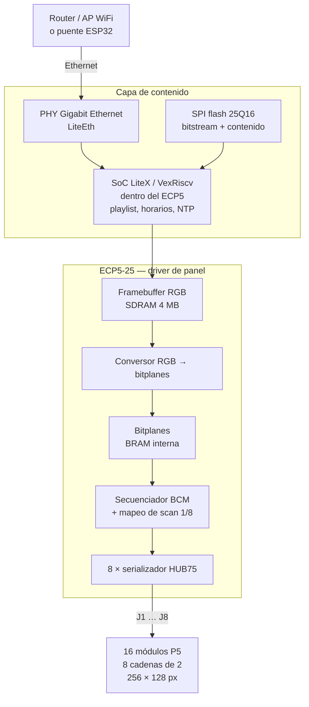

# 11 — Arquitectura del driver sobre Colorlight 5A-75B

Plataforma adoptada en [`10_plataforma_driver.md`](10_plataforma_driver.md). Este documento define la arquitectura del sistema, el punto de operación y el plan de bring-up del driver propio.

> **No sobrescribir el flash de configuración sin respaldo previo.** La 5A-75B arranca desde una SPI flash 25Q16 con el bitstream de fábrica. Volcar esa imagen completa antes de escribir nada.

## La placa

| Elemento | Detalle |
|---|---|
| FPGA | Lattice ECP5 **LFE5U-25F**, 24.300 LUT, **1.008 Kbit** de BRAM (EBR) |
| Salidas | **8 conectores HUB75** con level shifters 3,3 → 5 V en placa |
| Memoria externa | 2× SDRAM 1M×16 (M12L16161A o equivalente) = **4 MB** |
| Red | 2× PHY Gigabit Ethernet (Broadcom B50612D) |
| Configuración | SPI flash 25Q16 (2 MB) |
| Reloj | Oscilador de 25 MHz en placa |
| Costo | USD 15–20 |

### Revisión a comprar

La placa tiene variantes de hardware con **pinouts distintos**: 6.1, 7.0, 8.0 y 8.2. Esto no es un detalle menor — el mapeo de pines del FPGA a los conectores HUB75 cambia entre revisiones.

**Comprar revisión 8.0 u 8.2.** Son las que `litex-boards` soporta con LiteDRAM (controlador de SDRAM), lo que habilita usar los 4 MB de memoria externa sin escribir un controlador propio. Al recibir la placa, identificar la revisión serigrafiada y contrastarla contra [chubby75](https://github.com/q3k/chubby75/tree/master/5a-75b) antes de escribir una línea de HDL.

## Arquitectura del sistema

La 5A-75B es una **placa receptora**: no tiene WiFi, RTC ni almacenamiento de playlist. El sistema completo necesita una capa de contenido por encima.

### Enlace de contenido

Tres opciones, en orden de preferencia:

1. **SoC LiteX con VexRiscv dentro del propio ECP5** (recomendada). LiteX aporta el softcore RISC-V, LiteEth y LiteDRAM ya integrados para esta placa. La lógica de playlist, horarios y NTP corre en el FPGA; el contenido llega por Ethernet. No hace falta MCU externo. WiFi se resuelve con un AP o puente en el gabinete, que además sirve para mantenimiento.
2. **ESP32 externo por SPI.** Más simple conceptualmente, pero requiere pines libres accesibles en la placa — los buffers de los puertos HUB75 son unidireccionales de salida y no sirven como entrada. Hay que verificar puntos de test disponibles contra chubby75.
3. **ESP32 con MAC Ethernet** (ESP32 clásico con PHY RMII, o ESP32-P4) hablando con LiteEth. Útil si se quiere mantener el ecosistema ESP-IDF para el contenido.

Durante el bring-up **no se necesita ninguna de las tres**: los patrones de prueba se generan dentro del FPGA.

## Topología de paneles

Cambia respecto del diseño original con HD-WF4:

| | HD-WF4 | **5A-75B** |
|---|---|---|
| Cadenas | 4 de 4 módulos | **8 de 2 módulos** |
| Puertos usados | 4 de 4 | 8 de 8 |
| Cables flat | 16 | 16 (sin cambio) |
| Clocks por bitplane | 8.192 | **2.048** |

Cada fila física del cartel (4 módulos) se divide en **dos cadenas de 2 módulos**, alimentadas por dos puertos contiguos. El cableado de potencia 5 V no cambia: sigue siendo una fuente LRS-350-5 por fila con dos inyecciones de 12 AWG. Ver [`03_electrico.md`](03_electrico.md).

## Presupuesto de memoria

Los 1.008 Kbit de BRAM equivalen a **126 KB**. Un frame de 256 × 128 px ocupa:

| Profundidad | bits/px | Frame | % de BRAM | Doble buffer |
|---|---:|---:|---:|---|
| 4 bits/color | 12 | 48 KB | 38 % | 76 % — entra |
| **5 bits/color** | 15 | **60 KB** | **48 %** | 95 % — demasiado justo |
| 6 bits/color | 18 | 72 KB | 57 % | no entra |
| 8 bits/color | 24 | 96 KB | 76 % | no entra |

**Diseño adoptado**: los bitplanes viven en BRAM (acceso determinista, sin latencia de SDRAM en el camino crítico del refresco) y los frames RGB más el contenido viven en la SDRAM de 4 MB. El conversor RGB → bitplanes corre solo cuando cambia el contenido, no en cada refresco.

Esto evita el problema que descartó al EP4CE6: el refresco lee de memoria local rápida, y el enlace de contenido solo mueve datos cuando hay un cambio de slide — **~12 KB/s promedio en vez de 12,3 MB/s sostenidos**.

## Punto de operación

Con 8 buses, 2.048 clocks por bitplane:

| Profundidad | 12,5 MHz | 16 MHz | 25 MHz |
|---|---:|---:|---:|
| 4 bits/color | 407 Hz | 521 Hz | 814 Hz |
| **5 bits/color** | **197 Hz** | **252 Hz** | 394 Hz |
| 6 bits/color | 97 Hz | 124 Hz | 194 Hz |

**Objetivo inicial: 5 bits/color a 12,5 MHz = ~197 Hz.** Es conservador en clock, cumple el criterio de aceptación y deja margen amplio hacia arriba. El clock de panel se sube a 16 o 25 MHz solo después de verificar con analizador lógico que no hay ghosting ni pérdida de integridad de señal en los cables flat.

Para cartelería exterior, 5 bits por color (32.768 colores) es suficiente. Subir a 6 bits sigue siendo viable a 25 MHz si el contenido lo justifica.

## Bloques HDL

| Bloque | Responsabilidad |
|---|---|
| `hub75_serializer` (×8) | Desplaza RGB, genera `CLK` por puerto. Idéntico ocho veces, instanciado en paralelo. |
| `bcm_sequencer` | Secuencia de bitplanes, ancho de pulso de `OE`, blanking de `LAT`, avance de dirección `A`/`B`/`C`. Uno solo: gobierna los ocho serializadores en lockstep. |
| `scan_mapper` | Traduce `(x, y)` del framebuffer a `(paso de dirección, posición en cadena, grupo)`. **Específico del panel — es la incógnita principal.** |
| `bitplane_store` | BRAM de bitplanes, doble puerto: escritura del conversor, lectura del secuenciador. |
| `rgb_to_bitplane` | Conversión de frame RGB a planos de bits, con corrección de gamma. Corre en cambios de contenido. |
| `LiteDRAM` | Controlador de SDRAM. Provisto por LiteX en revisiones 8.0/8.2. |
| `LiteEth` | MAC + UDP/Etherbone. Provisto por LiteX. |

Los ocho serializadores comparten direcciones, `LAT` y `OE` — igual que la HD-WF4 compartía esas señales entre bancos. La diferencia es que acá los ocho transmiten **simultáneamente**, no alternados, porque cada uno tiene sus propios pines RGB.

## Toolchain

Todo abierto, sin licencias:

| Herramienta | Función |
|---|---|
| **Yosys** | Síntesis Verilog |
| **nextpnr-ecp5** | Place & route |
| **Project Trellis** | Generación de bitstream |
| **openFPGALoader** | Carga por JTAG y escritura de la SPI flash |
| **LiteX** + `litex-boards` | SoC, LiteEth, LiteDRAM, plataforma `colorlight_5a_75b` |
| **Verilator** / **cocotb** | Simulación y testbench |

Recomendado: instalar vía [oss-cad-suite](https://github.com/YosysHQ/oss-cad-suite-build), que trae todo empaquetado. Sobre Windows funciona bien bajo WSL2.

## Plan de bring-up

### Paso 0 — Identificar y respaldar

- [ ] Fotografiar ambos lados, anotar revisión serigrafiada y contrastar con chubby75.
- [ ] Verificar que sea revisión 8.0 u 8.2; si no, ajustar el archivo de plataforma de LiteX al pinout real.
- [ ] Volcar la SPI flash 25Q16 completa antes de escribir nada.
- [ ] Instalar oss-cad-suite y cargar un bitstream de blink por JTAG (sin tocar la flash) para validar el flujo.

### Paso 1 — Un módulo, un puerto, sin BCM

- [ ] Instanciar un solo `hub75_serializer` en `J1` con 1 bit por color.
- [ ] Mostrar rojo, verde, azul, blanco, negro y una grilla.
- [ ] Medir `CLK`, `LAT`, `OE` y `A`/`B`/`C` con analizador lógico.
- [ ] Confirmar niveles de salida de los level shifters de la placa.

### Paso 2 — Descubrir el mapeo de scan

- [ ] Si el vendedor entregó archivo de configuración, derivar el mapeo de ahí.
- [ ] Si no: encender un único píxel en la posición *k* de la cadena, fotografiar dónde aparece, e iterar sobre las 128 posiciones × 8 direcciones.
- [ ] Volcar el resultado en una tabla de lookup y codificarla en `scan_mapper`.
- [ ] **Este paso condiciona todo lo demás. No avanzar sin cerrarlo.**

### Paso 3 — BCM y profundidad de color

- [ ] Agregar `bcm_sequencer` con 4 bits por color en un puerto.
- [ ] Ajustar blanking de `LAT` y duración de `OE` hasta eliminar ghosting.
- [ ] Verificar refresco medido contra el calculado.
- [ ] Subir a 5 bits y confirmar linealidad con corrección de gamma.

### Paso 4 — Ocho puertos

- [ ] Instanciar los 8 serializadores con contenido distinto por cadena.
- [ ] Conectar las 8 cadenas de 2 módulos y verificar el mapeo 256 × 128 con patrón numerado.
- [ ] Confirmar que no haya cruce entre cadenas ni deriva de temporización.

### Paso 5 — Contenido y red

- [ ] Integrar LiteDRAM y mover el framebuffer RGB a SDRAM.
- [ ] Integrar LiteEth y el SoC LiteX.
- [ ] Playlist, reloj, NTP, brillo y actualización remota.

### Paso 6 — Estrés

- [ ] 24 h a patrón blanco en banco, con las mediciones de [`03_electrico.md`](03_electrico.md).

## Criterios de aceptación

Reemplazan a los de [`09_firmware_propio_hd_wf4.md`](09_firmware_propio_hd_wf4.md):

- Los ocho puertos muestran contenido distinto en su cadena correspondiente.
- No hay filas cruzadas, ghosting, colores alterados ni parpadeo visible a la distancia de uso.
- **Refresco efectivo ≥ 192 Hz a brillo operativo con 5 bits por color.**
- Las transiciones de dirección y latch mantienen `OE` deshabilitado.
- La alimentación de la matriz cumple las mediciones de [`03_electrico.md`](03_electrico.md).
- El bitstream de fábrica está respaldado y el procedimiento de restauración verificado.
- El contenido se actualiza por red sin reprogramar el FPGA.

## Riesgos y límites

- **Variación de revisión de placa.** Los pinouts difieren entre 6.1, 7.0, 8.0 y 8.2. Comprar sin especificar revisión es comprar un pinout desconocido.
- **IC driver del panel sin confirmar.** Si el módulo usa S-PWM interno (MBI5153, FM6353), el modelo BCM de este documento no aplica y el protocolo es otro. Ver [`08_hub75e_y_panel_p5.md`](08_hub75e_y_panel_p5.md).
- **Mapeo de scan desconocido.** Es el riesgo de cronograma más grande del driver. Se mitiga consiguiendo el archivo de configuración del vendedor.
- **Los level shifters de la placa** pueden ser 74HC245 en algunas revisiones, con umbrales de entrada distintos a los AHCT. Verificar contra chubby75.
- **Sin RTC ni WiFi en placa.** El reloj sale de NTP y la conectividad de un AP externo en el gabinete.
- **Verilog es otra disciplina.** El proyecto pasa de depurar un sistema a depurar tres: HDL, capa de contenido y el enlace entre ambos.

## Fuentes

- [chubby75 — 5A-75B](https://github.com/q3k/chubby75/tree/master/5a-75b) — esquemáticos, pinouts por revisión
- [YosysHQ: Introducing the Colorlight 5A-75B](https://blog.yosyshq.com/p/colorlight-part-1/)
- [litex-boards: plataforma `colorlight_5a_75b`](https://github.com/litex-hub/litex-boards/blob/master/litex_boards/platforms/colorlight_5a_75b.py)
- [litex-boards: target `colorlight_5a_75x`](https://github.com/litex-hub/litex-boards/blob/master/litex_boards/targets/colorlight_5a_75x.py)
- [Lattice ECP5 / ECP5-5G](https://www.latticesemi.com/en/Products/FPGAandCPLD/ECP5)
- [oss-cad-suite](https://github.com/YosysHQ/oss-cad-suite-build)
