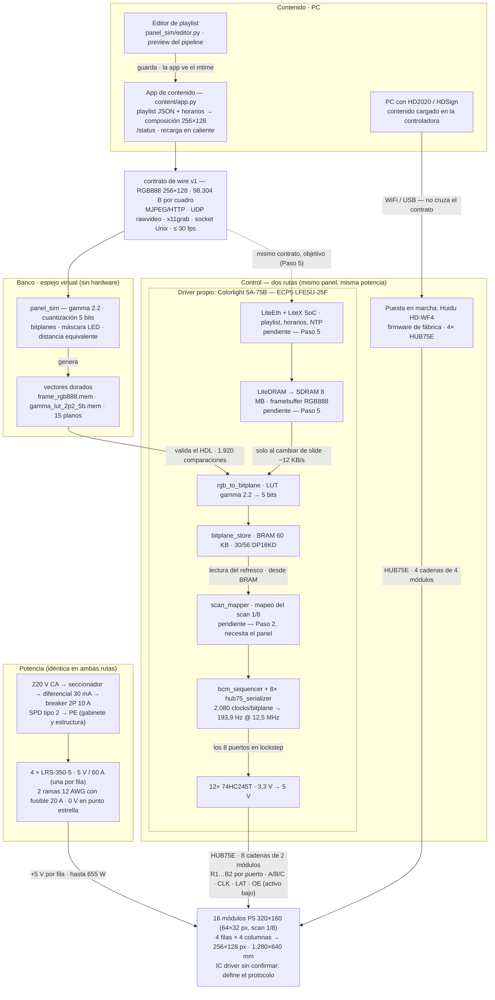
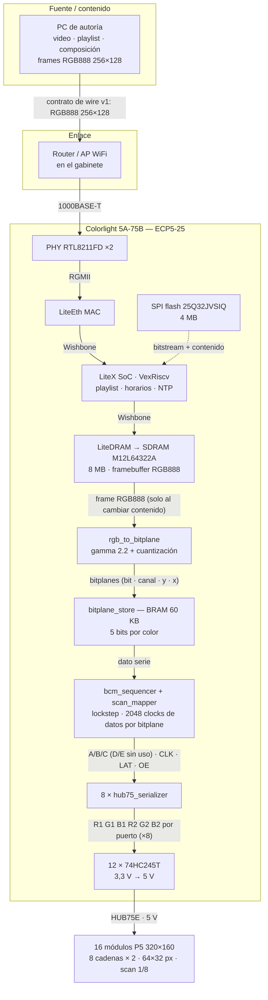
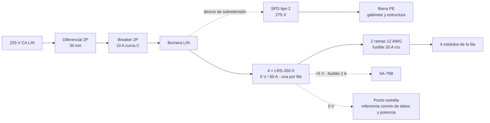

# 16 — Cadena completa: de la fuente al display

Vista de integración de la **ruta del driver propio** (Colorlight 5A-75B), desde el contenido hasta los módulos P5. No repite detalle: la potencia y el gabinete están en [`07`](07_diagrama_bloques.md), el driver y el plan de bring-up en [`11`](11_arquitectura_colorlight_5a75b.md), el software de contenido en [`14`](14_software_contenido.md). Acá está el mapa único que los une, con los nombres de señal, y la correspondencia con el simulador que ya validó los números.

Es la referencia de la fase "reproducir en electrónica lo que el simulador muestra".

## Vista de sistema

Mapa completo: contenido, contrato, control (las dos rutas), panel y potencia,
con el espejo virtual del banco de desarrollo. El detalle de cada bloque está
en las secciones siguientes y en [`07`](07_diagrama_bloques.md),
[`11`](11_arquitectura_colorlight_5a75b.md) y [`14`](14_software_contenido.md).

Los tres bloques marcados como pendientes son los que todavía no existen:
`LiteEth`/`LiteX` y `LiteDRAM` entran en el Paso 5, y el `scan_mapper` necesita
el panel físico (Paso 2). El enlace `App → SoC` va punteado por lo mismo: hoy
la app alimenta el panel virtual, y el HDL se valida contra los vectores que
ese mismo pipeline genera. La alimentación de la controladora —el ramal de
2 A— está en la sección de potencia de abajo y en [`07`](07_diagrama_bloques.md).

Estado de cada tramo:

| Elemento | Estado | Depende de |
|---|---|---|
| App de contenido (`content/`) | hecha: playlist, horarios, transporte y editor | — |
| Panel virtual (`panel_sim/`) | hecho y verificado | — |
| Bloques HDL del driver (5) | hechos y validados en simulación | — |
| `scan_mapper` | pendiente | el panel físico (Paso 2) |
| LiteX / LiteEth / LiteDRAM | pendiente | Paso 5 |
| Panel, fuentes y estructura | pendiente | compras de Fase 1 |

## Datos: fuente → panel

Cada fila física de 4 módulos se reparte en dos cadenas de 2: los 8 puertos se usan todos y `A`–`E`, `CLK`, `LAT` y `OE` van compartidas (lockstep). Solo `A`/`B`/`C` llevan información —el scan 1/8 necesita 2³ = 8 pasos—; `D` y `E` quedan disponibles de la placa pero sin uso. Detalle en [`11`](11_arquitectura_colorlight_5a75b.md).

## Potencia

Idéntica a la ruta de producción ([`07`](07_diagrama_bloques.md)): solo cambia el reparto de los cables de datos y la alimentación de la controladora.

`PE` no se usa como retorno de 5 V y las salidas positivas de las fuentes no se unen entre filas.

## Señales

| Señal | Enlace | Tipo / nota |
|---|---|---|
| `1000BASE-T` | PC/AP ↔ RTL8211FD | Ethernet 1 Gb, par trenzado Cat5e |
| `RGMII` | RTL8211FD ↔ FPGA | TXD/RXD[3:0] + TX_CTL/RX_CTL + clocks |
| `Wishbone` | interno LiteX | MAC · SoC · LiteDRAM (el bus por defecto de litex-boards; AXI existe como adaptador) |
| `frame RGB888` | SDRAM → conversor | 256×128; se mueve solo al cambiar contenido (~12 KB/s promedio) |
| `bitplanes[bit][canal][y][x]` | BRAM → secuenciador | 5 bits/color, 60 KB, **pre-mapeo de scan** |
| `R1 G1 B1 R2 G2 B2` | FPGA → panel, por puerto | 6 por puerto; ×8 = 48 |
| `A/B/C` · `D/E` | compartidas por los 8 puertos | `A`/`B`/`C`: paso de dirección (scan 1/8) · `D`/`E`: sin uso, a nivel bajo |
| `CLK` · `LAT/STB` · `OE` | compartidas por los 8 puertos | lockstep obligatorio · `OE` activo bajo ([`08`](08_hub75e_y_panel_p5.md)) |
| `+5V0` | fuentes → filas | una fuente por fila, 2 inyecciones 12 AWG |
| `0V` | retorno común | punto estrella; referencia GND de datos |
| `PE` | gabinete y estructura | no se usa como retorno de 5 V |
| `F1L…F4R` · `FC` | protección | fusibles 20 A por rama · 2 A control |

## Correspondencia con el simulador

Lo ya verificado en [`../simulator/`](../simulator/README.md) es lo que hay que reproducir en hardware:

| Simulador | Bloque de hardware | Número verificado |
|---|---|---|
| `quantize` | `rgb_to_bitplane` (FPGA, contrato v1) | `duty = (v/255)^γ`, γ 2.2 |
| `bitplanes.py` (layout `[bit][canal][y][x]`) | `bitplane_store` (BRAM) | 5 bits/color · 60 KB = 48 % de BRAM |
| `timing.refresh_hz` | `bcm_sequencer` | 2080 clocks/bitplane (2048 de datos + blanking) → 193,9 Hz @ 12,5 MHz, medido |
| máscara LED (gap 0.65, circular) | máscara física del módulo P5 | LED ≈ ⅓ del paso · pitch 5 mm |
| `viewing.py` | instalación | 5 m ↔ 416×208 px (monitor 32" 1080p a 60 cm) |

## Condicionantes abiertos

- ~~**Contrato de wire**: ¿la PC manda RGB888 o bitplanes ya serializados?~~ — resuelto en v1: la PC manda **RGB888 de 256×128** y la conversión (gamma, cuantización y armado de bitplanes) vive en el FPGA. Mandar bitplanes queda como posible v2. [`14`](14_software_contenido.md).
- **Familia del IC driver del módulo**: si es S-PWM interno (MBI5153/FM6353), el modelo BCM no aplica y el protocolo es otro. [`08`](08_hub75e_y_panel_p5.md).
- **Mapeo de scan 1/8**: la incógnita principal del driver; se resuelve en el Paso 2 del bring-up. [`11`](11_arquitectura_colorlight_5a75b.md).
- **Revisión de placa**: comprar 8.0 u 8.2; otra revisión implica otro pinout y otro archivo de plataforma LiteX.

## Fuentes

Las fuentes externas de esta cadena (chubby75, LiteX, YosysHQ) están en [`11_arquitectura_colorlight_5a75b.md`](11_arquitectura_colorlight_5a75b.md); no se duplican acá.
